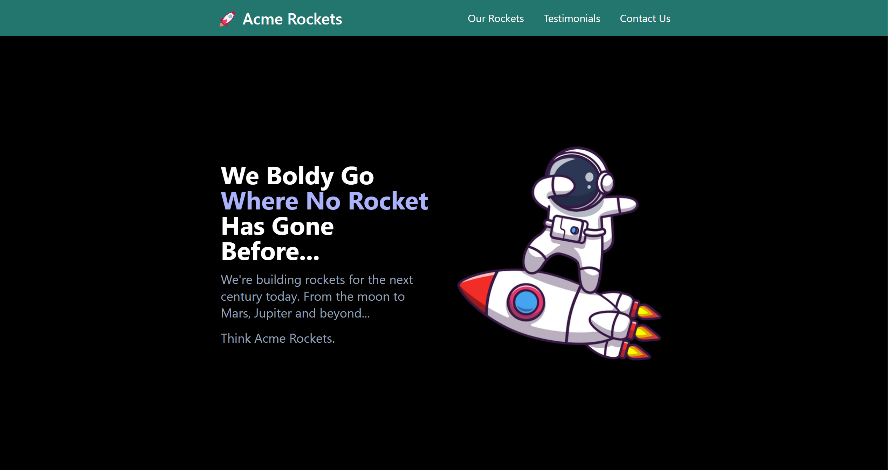
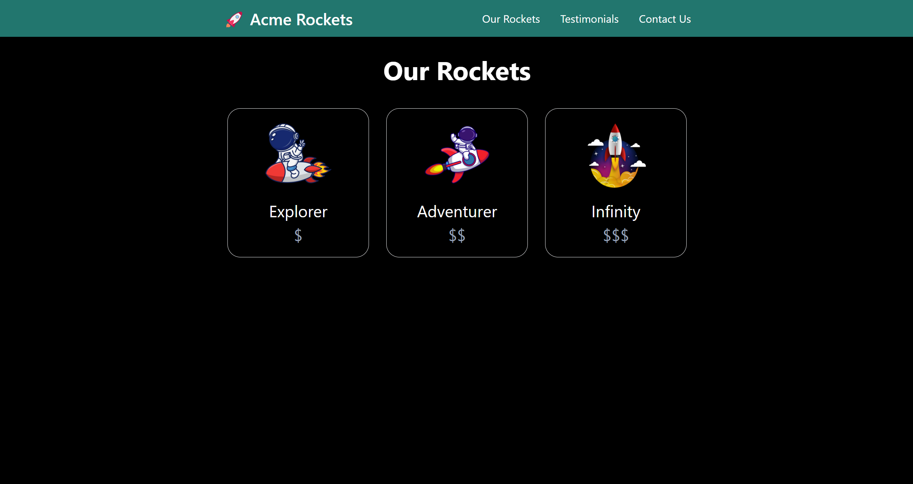
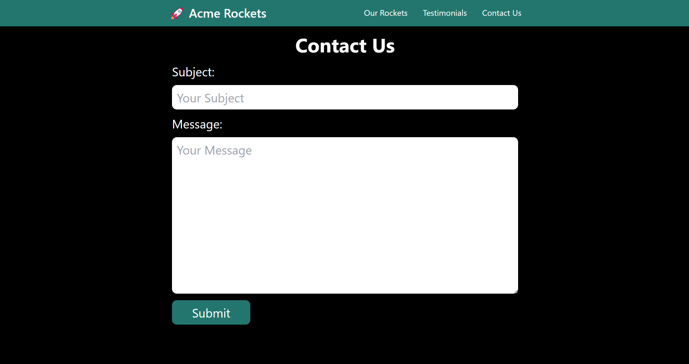
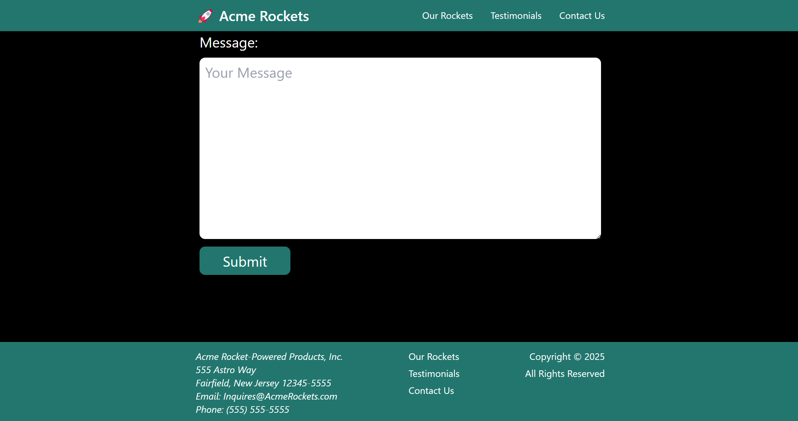
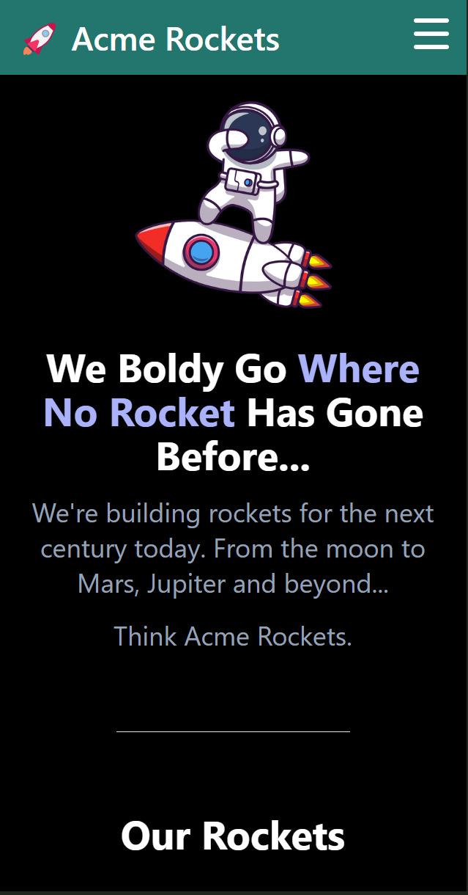

# Acme Rockets Tailwind

Acme Rockets Tailwind is a simple project created to learn and practice the Tailwind CSS framework. It serves as a responsive and modern landing page for a fictional rocket company, showcasing Tailwind's utility classes and design capabilities.

## Features

- Fully responsive design
- Utilization of Tailwind CSS utility-first approach
- Modern UI elements and layout
- Clean and minimalistic code structure

## Technologies Used

- HTML5
- Javascript
- Node Js
- Tailwind CSS

<p>
    &nbsp;&nbsp;&nbsp;
    &nbsp;&nbsp;&nbsp;
    &nbsp;&nbsp;&nbsp;
   

</p>
      

## Installation & Usage

1. Clone the repository:
   ```bash
   git clone https://github.com/yourusername/acme-rockets-tailwind.git
   ```
2. Navigate to the project directory:
   ```bash
   cd acme-rockets-tailwind
   ```
3. Open `index.html` in your browser to view the project.

## Tailwind CSS Setup

If you want to customize Tailwind CSS, follow these steps:

1. Install Tailwind CSS via npm (optional for customization):
   ```bash
   npm install -D tailwindcss
   ```
2. Generate Tailwind config file:
   ```bash
   npx tailwindcss init
   ```
3. Add Tailwind directives to your CSS file:
   ```css
   @tailwind base;
   @tailwind components;
   @tailwind utilities;
   ```
4. Build your Tailwind styles:
   ```bash
   npx tailwindcss -i ./src/input.css -o ./dist/output.css --watch
   ```


## Screenshots


### Homepage





### Responsive Design


## Contributing

If you'd like to contribute, feel free to fork the repository and submit a pull request.

## License

This project is licensed under the MIT License.

## Contact

For any questions or suggestions, feel free to reach out:
- GitHub: [dreadlord_sedai](https://github.com/dreadlord-sedai)
- Email: dahamifabbio@gmail.com

